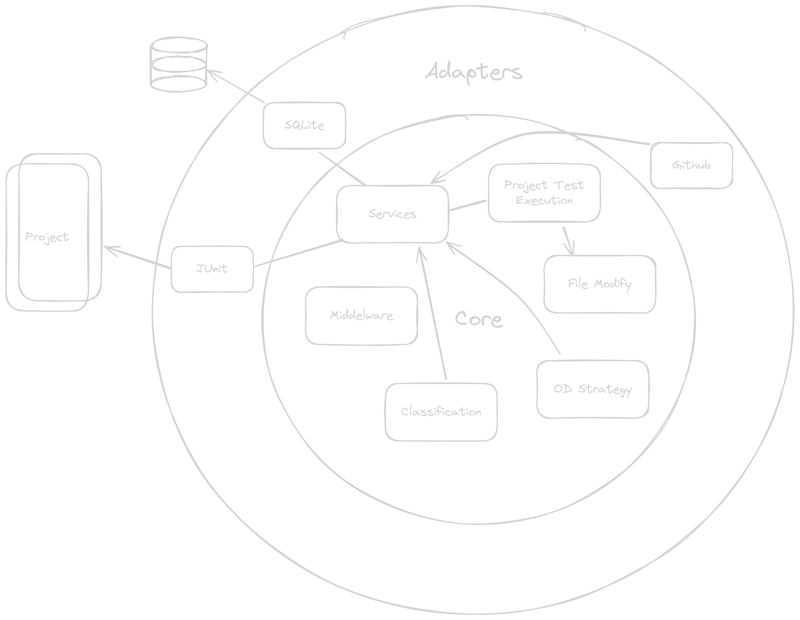

# kFlkay

KFlkay is a project that in its current form detects and classifies order dependent flaky tests in jUnit based test 
environments in Java and Kotlin. This project makes use of, but is not limited to, the annotations provided by junit. 
Annotations are used to change the test order of set tests, and thus recognize order dependencies.

## Usage

See the "usage" page or the "bring our own docker image" page if this is something you need.

## Contributing

All contributions are welcome. This project uses a hexagonal structure, see the contribution page for more information.

