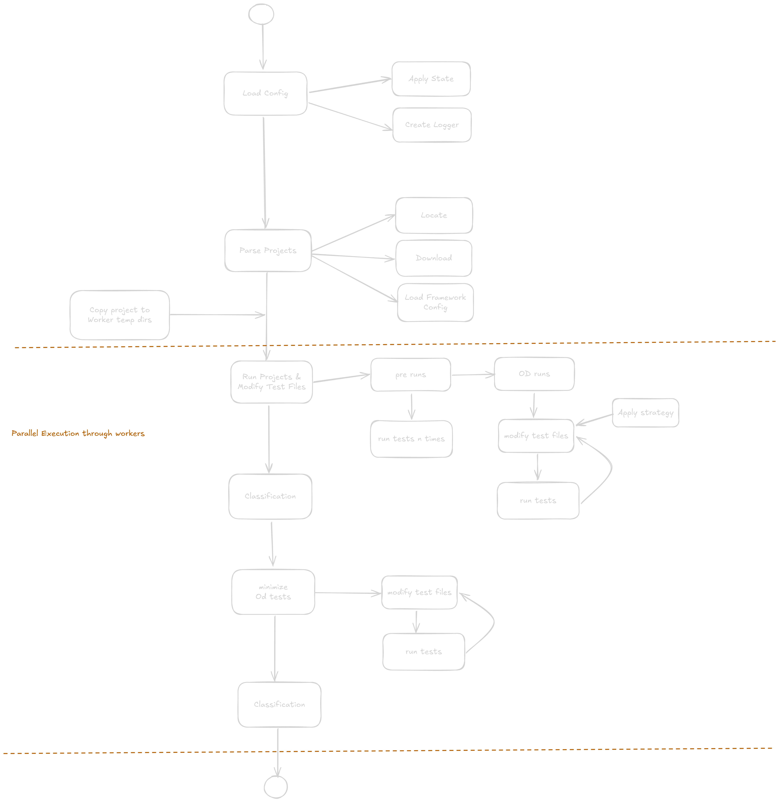

# Contributing

## Project Structure

A rough sketch of the flow on how projects are tested can be seen here:



## Development Setup

### Intelij

There is a run config in the `/run` directory that can be used for local testing.
Note: You need a project to test with, edit the config.json according to the usage guide.

### Gradle

Build the jar file:
- run from the project root directory: ./gradelw build
- move the jar file (from build/libs/kFlaky.jar) to the same directory as your config.json.

```
./gradlew build
cp ./build/libs/kFlaky*.jar ./kFlaky.jar
java -jar ./kFlaky.jar
```

wip

## Testing

See the usage page for more information.